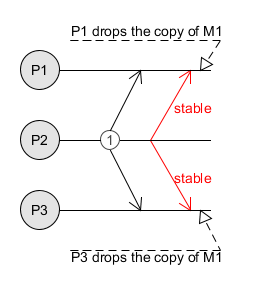
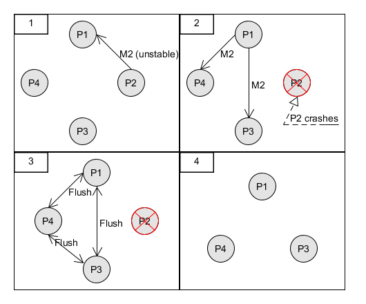

# Project report - Distributed Systems 1

A.Y. 2017 - 2018
Authors: *Garau Nicola* and *Manfredi Salvatore*

## 1 - Introduction

The project is an implementation of the **Virtual Synchrony** protocol used for reliable group communication.

A multicast (group communication) is reliable when each sent message is delivered to every member of the group. Unlike other techniques, in which the groups are fixed, virtual synchrony exploits the presence of dynamic groups where the processes can join or leave.

The project has been implemented in Java using <u>Akka</u>, a toolkit designed for the creation of concurrent and distributed message-driven applications.

## 2 - Protocol

Virtual synchrony is a distributed algorithm whose functioning revolves around the concept of **view**. 

### 2.1 - View

A view is nothing but a "list" of the processes part of the current group.

Each time a process joins or leaves (either voluntarily or due to a crash) the group, all the participants **install** a new view and take care of the <u>unstable</u> messages.

**Note**: messages cannot cross epochs. This means that a message sent before a new view install must be delivered before the receiver installs the new view.

### 2.2 - Message stability

Multicast is implemented as a sequence of unicast messages and can fail only when the sender crashes before transmitting all the messages.

To avoid related issues, each member of the group keeps a copy of the message until every process has it. When this happens, the message becomes **stable**.

The sender announces the message stability by sending a second message to all the recipients.

In the image above, the red arrow signal the message stability.

### 2.3 - Flush messages

Before a view change, all the group participants must:

1. **not** send new multicast messages;
2. send all the <u>unstable</u> messages to all the other processes in the new view (the leavers and the entities crashed will not receive this message);
3. send a **flush** message that signals the end of the transmission;
4. once a process receives a flush message from **all** the others, it can install the new view and resume its normal functioning.

*In the fourth panel, the new view.*

## 3 - Classes (WIP)

### 3.1 - Actors
##### GenericActor
##### GroupManager
##### Participant

### 3.2 - Enums
##### ActorStatusType
##### ActorType
##### SendingStatusType

### 3.3 - Messages
##### AssignId
##### CanSendHeartbeat
##### ChangeView
##### CrashDetected
##### GenericMessage
##### Heartbeat
##### JoinRequest
##### Message

### 3.4 - Views
##### View

[^roba]: robaccia

