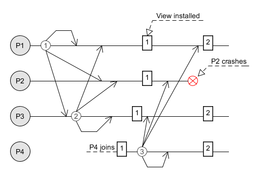
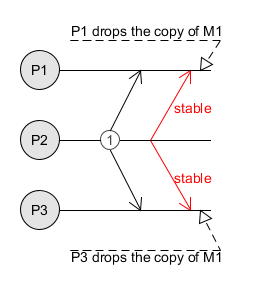
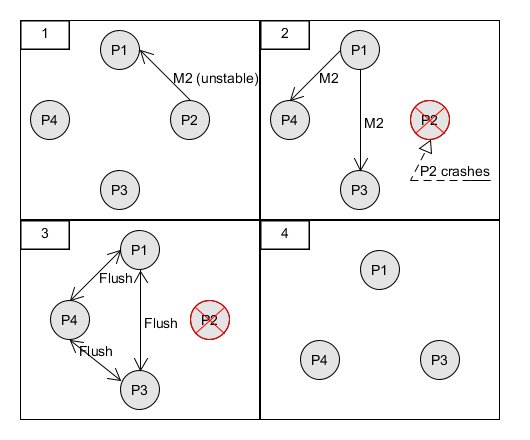

# Project report - Distributed Systems 1

A.Y. 2017 - 2018

Authors: *Nicola Garau* and *Salvatore Manfredi*

## 1 - Introduction

The project is an implementation of the **Virtual Synchrony** protocol used for reliable group communication.

A multicast (group communication) is reliable when each sent message is delivered to every member of the group. Unlike other techniques, in which the groups are fixed, virtual synchrony exploits the presence of dynamic groups where the processes can join or leave.

The project has been implemented in Java using <u>Akka</u>, a toolkit designed for the creation of concurrent and distributed message-driven applications.

## 2 - Protocol

Virtual synchrony is a distributed algorithm whose functioning revolves around the concept of **view**. 

### 2.1 - View

A view is nothing but a "list" of the processes part of the current group.

Each time a process joins or leaves (either voluntarily or due to a crash) the group, all the participants **install** a new view and take care of the <u>unstable</u> messages.

**Note**: messages cannot cross epochs. This means that a message sent before a new view install must be delivered before the receiver installs the newly installed view.

### 2.2 - Message stability

Multicast is implemented as a sequence of unicast messages and can fail only when the sender crashes before transmitting all the messages.

To avoid related issues, each member of the group keeps a copy of the message until every process has it. When this happens, the message becomes **stable**.

The sender announces the message stability by sending a second message to all the recipients.

In the image above, the red arrow signal the message stability.

### 2.3 - Flush messages

Before a view change, all the group participants must:

1. **not** send new multicast messages;
2. send all the <u>unstable</u> messages to all the other processes in the new view (the leavers and the entities crashed will not receive this message);
3. send a **flush** message that signals the end of the transmission;
4. once a process receives a flush message from **all** the others, it can install the new view and resume its normal functioning.

*In the fourth panel, the new view.*

## 3 - Classes 

This section will briefly detail the main structure of the project.

### 3.1 - Actors

Actors are the core of the distribute program. Each actor identifies an "entity" that can interact with others by sending messages.

#### GenericActor

Abstract class whose capabilities will be extended by the two classes discussed below.

It contains the methods that will be inherithed by the specific actors. Among these methods it is worth mentioning `installView(view)`, `sendUnstableMessage()` and `sendFlushMessage()` (for an explaination of their purposes, please refer to sections 2.1, 2.2 and 2.3 respectively).

#### GroupManager

The GroupManager is the first "specialized" Actor. It manages the group and handles the detection of <u>crashes</u>, <u>joins</u> and <u>timeouts</u>.

It is also responsible for requesting new views to update the composition of the group.

#### Participant

The Participants sends messages to to the other participants in order to simulate a multicast and regularly sends ha *heartbeat* message to reset its timeout.

### 3.2 - Enums

Enums are classes that group together actors'attributes.

There are three classes.

#### ActorStatusType

Identifies the status of each actor. It can be:

   - STARTED;

   - WAITING;

   - CRASHED;

#### ActorType

Describes the type of the actor. It can either be:

   - MANAGER (only possessed by the node 0);

   - PARTICIPANT;

#### SendingStatusType

Signals the <u>sending</u> status of the actor. It can be:

   - FREE;

   - SENDING.

### 3.3 - Messages

Messages identify the transmissions sent by the actors to each other. There are many different types of messages and their names are self-explainatory:

- **AssignId**;
- **CanSendHeartbeat**;
- **ChangeView**;
- **CrashDetected**;
- **GenericMessage**;
- **Heartbeat**;
- **JoinRequest**;
- **Message**.

### 3.4 - Views

As mentioned in <u>section 2.1</u>, a view is nothing more than a list of the current participants to the message exchange.

#### View

The core of this class is the variable `participants` which contains the set of the multicast members.

An instance of the class is installed by each actor who is part of the view. With this varible each member knows which other process is ready to get messages.
